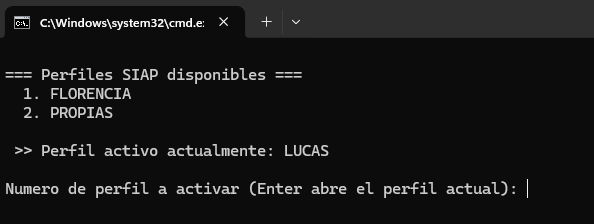
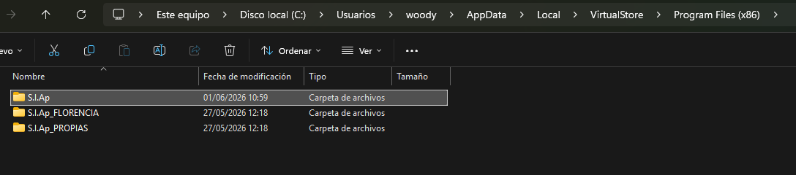

<h1 align="center">🔄 SIAP Profile Switcher</h1>

<p align="center">
  Cambiá de perfil de <b>S.I.Ap (AFIP / ARCA)</b> de forma segura y abrí el programa con un solo comando.
</p>

<p align="center">
  
</p>

El S.I.Ap no soporta múltiples contribuyentes de forma nativa: todos comparten la misma base de datos local. Si trabajás con varios CUIT (estudio contable, varias empresas, etc.), terminás pisando datos o haciendo backups manuales.

> ⚠️ **Proyecto no oficial**, sin afiliación con AFIP / ARCA. Usalo bajo tu responsabilidad y realizá backups periódicos.

---

##  Características

- ✅ Cambio seguro entre perfiles.
- ✅ Apertura automática de S.I.Ap.
- ✅ Detección del perfil activo.
- ✅ Rollback automático si ocurre un error.
- ✅ Evita cambiar de perfil mientras S.I.Ap está abierto.
- ✅ Modo interactivo.
- ✅ Modo directo por línea de comandos.

---

##  ¿Por qué existe?

S.I.Ap fue diseñado para trabajar con una única base de datos local. Esto dificulta el trabajo de estudios contables y usuarios que administran múltiples contribuyentes.

Este proyecto automatiza el cambio entre perfiles reutilizando la virtualización de archivos de Windows (**VirtualStore**), evitando copiar carpetas manualmente o restaurar backups cada vez que necesitás cambiar de CUIT.

---

## ⚙️ ¿Cómo funciona?

S.I.Ap guarda sus datos mediante la virtualización de UAC de Windows en:

```text
%LOCALAPPDATA%\VirtualStore\Program Files (x86)\S.I.Ap
```

<p align="center">
  
</p>

El script considera esa carpeta como el **perfil activo** y almacena el resto como carpetas hermanas con el formato `S.I.Ap_<nombre>`.

Al cambiar de perfil:

1. Verifica que S.I.Ap no esté ejecutándose.
2. Archiva el perfil activo.
3. Monta el perfil seleccionado.
4. Actualiza `perfil.txt`.
5. Abre automáticamente S.I.Ap.

Si el montaje falla, restaura automáticamente el perfil anterior mediante rollback.

---

##  Uso

### Modo interactivo

```bat
siap-profile-switcher.bat
```

Presioná **Enter** sin seleccionar un número para abrir el perfil actualmente activo.

### Modo directo

```bat
siap-profile-switcher estudio
```

---

##  Configuración inicial

1. Ejecutá S.I.Ap al menos una vez.
2. Creá `perfil.txt` dentro del perfil activo con el nombre del perfil.
3. Para crear perfiles adicionales, copiá la carpeta `S.I.Ap` como `S.I.Ap_<nombre>` y modificá el `perfil.txt` correspondiente.
4. ¡Listo!

---

##  Configuración

Si tu instalación utiliza rutas distintas, modificá estas variables al comienzo del script:

```bat
set "SIAP_PARENT=%LOCALAPPDATA%\VirtualStore\Program Files (x86)"
set "SIAP_NAME=S.I.Ap"
set "SIAP_EXE=C:\Program Files (x86)\S.I.Ap\AFIP\SIAp.exe"
```

---

##  Requisitos

- Windows
- S.I.Ap instalado
- Datos almacenados en `VirtualStore`

---

##  Licencia

Distribuido bajo licencia MIT.
